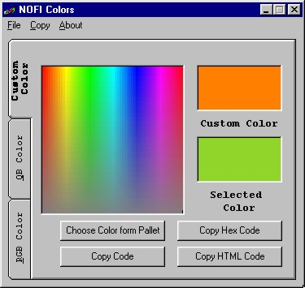



## NOFI Colors

### Description

NOFI Colors is an easiest-to-use small utility that helps you to save the color of your choice. You can Copy the RGB function or QBColor function or the Hexadecimal code of any color to the Clipboard which can be used while coding your application in Microsoft Visual Basic. You can also Copy the HTML code of any color to the Clipboard which can be used while designing your Web Page. Your comments will help me to improve.
 
### More Info
 

             |
---                |---
**Submitted On**   |2001-04-12 23:59:20
**By**             |[Irfan ul Haq Farooqi](https://github.com/Planet-Source-Code/PSCIndex/blob/master/ByAuthor/irfan-ul-haq-farooqi.md)
**Level**          |Intermediate
**User Rating**    |4.0 (8 globes from 2 users)
**Compatibility**  |VB 5\.0, VB 6\.0
**Category**       |[Complete Applications](https://github.com/Planet-Source-Code/PSCIndex/blob/master/ByCategory/complete-applications__1-27.md)
**World**          |[Visual Basic](https://github.com/Planet-Source-Code/PSCIndex/blob/master/ByWorld/visual-basic.md)
**Archive File**   |[NOFI Color182904122001\.zip](https://github.com/Planet-Source-Code/irfan-ul-haq-farooqi-nofi-colors__1-22361/archive/master.zip)

